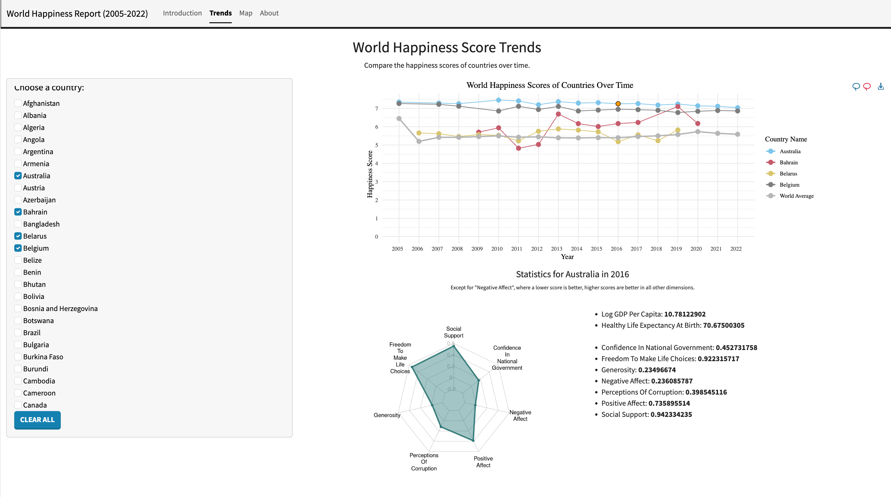
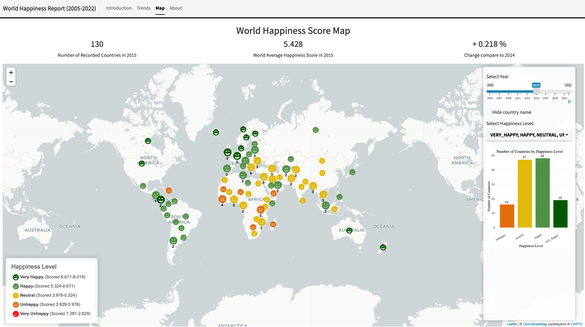
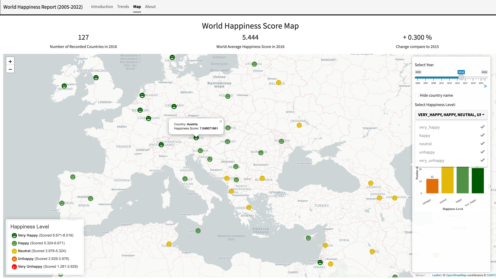

# Information_Visualization_World_Happiness
An R project visualiza world happiness report from 2013 to 2023

## Introduction

This project is an interactive Shiny application that explores global well-being trends using data from the **World Happiness Report (2005–2022)**. It allows users to compare happiness scores across countries and years through coordinated visualisations, including line charts, radar charts, and an interactive world map. The application emphasises clarity, visual hierarchy, and accessibility, enabling users to explore temporal trends, spatial distributions, and multi-dimensional indicators of happiness in an intuitive way.

## Authors
 - Ziqi Ding (1335237)

## Demo
  * [Live demo](https://katrina-ziqi-ding.shinyapps.io/World-Happiness-2005-to-2022/)

## Screenshots

The following screenshots demonstrate the key interactive views and design choices of the application.

### Trends – Temporal Comparison


### Map – Spatial Distribution


### Map – Regional Detail & Controls



## How to Run the App Locally

This app was originally built with older spatial packages that are no longer supported on modern R versions. The steps below describe the **stable, reproducible setup** used to run the app successfully on a clean local environment.

---

### 1. Prerequisites

- **R = 4.3.3**
- **RStudio (recommended)**
- Internet connection (for initial package install only)

---

### 2. Install Required R Packages

Install all dependencies explicitly before running the app:

```r
install.packages(c(
  "shiny",
  "leaflet",
  "sf",
  "rnaturalearth",
  "rnaturalearthdata",
  "ggplot2",
  "ggiraph",
  "dplyr",
  "bslib",
  "htmlwidgets",
  "shinydashboard",
  "shinyWidgets",
  "fmsb",
  "rcartocolor",
  "terra",
  "raster",
  "maps"
))
```

> ⚠️ Do **not** install packages at runtime inside `app.R`. All dependencies must be present before launch.

---

### 3. Spatial Data Setup (Important)

Older versions of this app fetched world map geometry at runtime using deprecated spatial packages (`rgdal`, `rgeos`, `maptools`).  
To ensure compatibility with modern R, spatial data is now **pre-generated and loaded from disk**.

#### One-time preparation

Execute the following code in RStudio console once to create the `worldMap.rds` file:

```r
library(rnaturalearth)
library(sf)

worldMap <- ne_countries(scale = "medium", returnclass = "sf")
saveRDS(worldMap, "worldMap.rds")
```

The app now loads this file directly:

```r
worldMap <- readRDS("worldMap.rds")
```

This avoids runtime downloads and deprecated GIS dependencies.

---

### 4. Verify Package Availability

Before running the app, run the following code in console to confirm all required packages are installed:

```r
required <- c(
  "shiny","leaflet","sf","rnaturalearth","rnaturalearthdata",
  "ggplot2","ggiraph","dplyr","bslib","htmlwidgets",
  "shinydashboard","shinyWidgets","fmsb","rcartocolor",
  "terra","raster","maps"
)

setdiff(required, rownames(installed.packages()))
```

If this returns an empty vector, you are good to proceed.

---

### 5. Run the App

From the project root:

```r
shiny::runApp("app")
```

The app should start without:
- Package installation prompts
- Deprecated spatial warnings
- Runtime failures

---

### Notes

- Runtime installation of packages is intentionally disabled.
- Deprecated spatial packages (`rgdal`, `rgeos`) are **not required**.
- The app is compatible with modern R and Shiny hosting platforms.

---


## Project Structure

```
.
├── app
│   ├── app.R                                         # R script for Shiny app
│   ├── app.Rproj                                     # R project file
│   ├── World Happiness Report 2005-Present.csv       # Datasets
│   └── www
│       └── icons
│           ├── face-frown-regular.svg
│           ├── face-frown-solid.svg
│           ├── face-grin-beam-regular.svg
│           ├── face-grin-beam-solid.svg
│           ├── face-meh-regular.svg
│           ├── face-meh-solid.svg
│           ├── face-sad-tear-regular.svg
│           ├── face-sad-tear-solid.svg
│           ├── face-smile-regular.svg
│           └── face-smile-solid.svg
├── app.zip
└── README.md
```

## Data & References

- World Happiness Report: https://worldhappiness.report/
- Dataset (Kaggle): https://www.kaggle.com/datasets/usamabuttar/world-happiness-report-2005-present
- Shiny & Leaflet documentation: https://shiny.posit.co/ · https://rstudio.github.io/leaflet/
- Map tiles: CartoDB Positron
- Icons: Font Awesome (free icons)